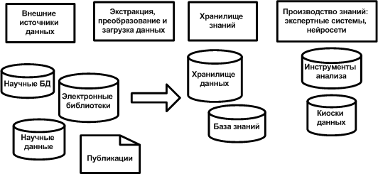
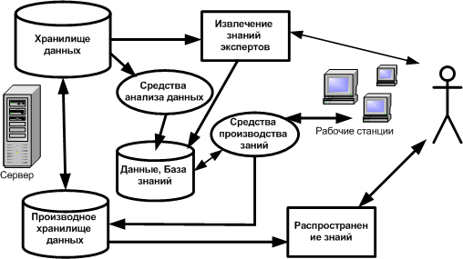
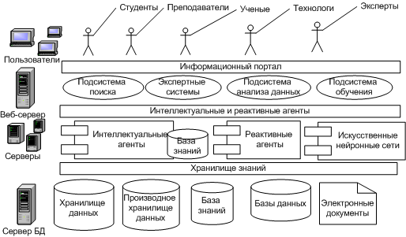

---
## Front matter
title: "Реферат"
subtitle: "на тему: Предметно-ориентированные системы научной осведомлённости"
author: "Соболевский Денис Андреевич"

## Generic otions
lang: ru-RU
toc-title: "Содержание"

## Bibliography
bibliography: bib/cite.bib
csl: pandoc/csl/gost-r-7-0-5-2008-numeric.csl

## Pdf output format
toc: true # Table of contents
toc-depth: 2
lof: true # List of figures
fontsize: 12pt
linestretch: 1.5
papersize: a4
documentclass: scrreprt
## I18n polyglossia
polyglossia-lang:
  name: russian
  options:
	- spelling=modern
	- babelshorthands=true
polyglossia-otherlangs:
  name: english
## I18n babel
babel-lang: russian
babel-otherlangs: english
## Fonts
mainfont: PT Serif
romanfont: PT Serif
sansfont: PT Sans
monofont: PT Mono
mainfontoptions: Ligatures=TeX
romanfontoptions: Ligatures=TeX
sansfontoptions: Ligatures=TeX,Scale=MatchLowercase
monofontoptions: Scale=MatchLowercase,Scale=0.9
## Biblatex
biblatex: true
biblio-style: "gost-numeric"
biblatexoptions:
  - parentracker=true
  - backend=biber
  - hyperref=auto
  - language=auto
  - autolang=other*
  - citestyle=gost-numeric
## Pandoc-crossref LaTeX customization
figureTitle: "Рис."
listingTitle: "Листинг"
lofTitle: "Список иллюстраций"
lolTitle: "Листинги"
## Misc options
indent: true
header-includes:
  - \usepackage{indentfirst}
  - \usepackage{float} # keep figures where there are in the text
  - \floatplacement{figure}{H} # keep figures where there are in the text
---

# Введение

С развитием информационных технологий и научных исследований количество информации в различных сферах знаний растёт с каждым днём. В связи с этим возникает потребность в предметно-ориентированных системах научной осведомлённости, которые помогают пользователям навигировать в обширном мире научных публикаций, отслеживать последние достижения и исследования, а также делиться результатами своей работы с коллегами.

# Определение предметно-ориентированных систем научной осведомлённости

Предметно-ориентированные системы научной осведомлённости (ПОСНО) - это интеллектуальные информационные системы, которые интегрируют, анализируют и представляют научную информацию в удобном и структурированном виде, ориентируясь на конкретные области знаний и интересы пользователей. Эти системы обеспечивают эффективный доступ к актуальным исследованиям, публикациям и данным, что позволяет ученым и специалистам оперативно следить за развитием своей предметной области и принимать обоснованные решения.

Общая программная архитектура такой системы показана на Рис. 1.

Как показано на рисунке 1, основными компонентами предметно-ориентированной системы научной осведомленности являются, помимо инструментария интеллектуального анализа данных, хранилище знаний и подсистема производства профессиональных знаний, включающая набор встроенные экспертных систем и искусственных нейронных сетей.
С учетом требования анализа и производства знаний в программно-технологическую архитектуру предметно-ориентированных систем научной осведомленности предъявляются следующие дополнительные программные компоненты:

• Компонент фактографических научных баз данных, содержащих экспериментальные или модельные данные, в частности, фундаментальные константы, числовые и лингвистические характеристики химических или физических процессов.
• Компонент интеллектуального анализа данных. Поскольку новые инструменты научных исследований обладают исключительной точностью, увеличивается точность и качество фактографических данных. Для анализа таких данных с целью нахождения тонких эффектов, упущенных в предыдущих исследованиях, требуется набор алгоритмов, позволяющий проводить сложный анализ данных.
• Компонент производства новых знаний. Найденные в результате интеллектуального анализа данных эмпирические закономерности позволяют строить прогнозы значений физических или химических процессов и оценивать значение фундаментальных характеристик материалов. Это создает предпосылки для встраивания в предметно-ориентированные системы научной осведомленности элементов прикладного искусственного интеллекта, например, экспертных систем для производства новых знаний и их сохранения в системе.
• Компонент распространения профессиональных знаний (дистанционного обучения). Наличие такого компонента в системе делает ее более привлекательной для использования и распространения предметно-ориентированных знаний, а также служит привлечению заинтересованного круга профессиональных пользователей к производству новых знаний.

Предметно ориентированные системы научной осведомленности могут быть созданы в научных проектах меньшего масштаба. При хорошо организованной и спроектированной системе метаданных, они легко могут быть интегрированы в более крупные системы научной осведомленности с учетом территориальной распределенности последних.
Для разработки и создания предметно-ориентированных систем научной осведомленности целесообразно использовать технологии мультиагентных систем. Компонентом такой системы становится интеллектуальный агент, который можно представить в виде веб - приложения, наделенного искусственным интеллектом, и расположенного за некоторым внешним порталом. При этом сам агент ориентирован на обработку научных данных в узкоспециализированном разделе предметной области. При наличии протокола взаимодействия между такими агентами, система научной осведомленности в целом строится поэтапно.

## Хранилище знаний предметно-ориентированных систем научной осведомленности

Центральным компонентом предметно-ориентированных систем научной осведомленности является хранилище знаний.
Подобно хранилищу данных, хранилище знаний может рассматриваться как предметно-ориентированная, интегрированная, содержащая временные ряды и поддерживающая процесс принятия решений электронная коллекция. Однако, в отличие от хранилища данных, хранилище знаний является комбинацией неизменяемых и изменяемых объектов и компонент, и должна хранить не только данные, но и знания предметной области.
В процессе исследования данных методами интеллектуального анализа полученные знания могут изменяться. Так могут измениться параметры центра кластера в зависимости от поступления новых данных или используемого алгоритма кластеризации. Или может быть уточнен вид зависимости в данных. Например, параболический тренд может оказаться справедливым только в определенном интервале, а вне этого интервала будет иметь место линейный тренд. Компонент производства знаний может генерировать данные, которые являются прогнозом значений некоторого параметра, но экспериментального подтверждения не имеют, т.е. знания, хранимые в хранилище знаний, могут изменяться и дополняться в результате его эксплуатации.
Хранилище знаний - предметно-ориентированная, интегрированная, поддерживающая временные ряды данных электронная коллекция, которая содержит данные, знания, процедуры генерирования знаний и используется для анализа и исследования данных, производства новых знаний и поддержки принятия решений. Общая программно-аппаратная архитектура хранилища знаний приведена на Рис. 2.

Как видно из рисунка 2, хранилище знаний включает хранилище данных для исследования (Exploration Data Warehouse), которое содержит неизменяемые во времени данные (экстенсиональный фрагмент хранилища данных), базу знаний выделенной предметной области, встроенные механизмы производства профессиональных знаний, хранилище производных данных (интенциональный фрагмент хранилища данных), интерфейс пользователя и интерфейс эксперта. Интерфейс пользователя предназначен для выборки и распространения знаний, а интерфейс эксперта - для производства новых знаний.

## Программно-технологическая архитектура предметно-ориентированной системы научной осведомленности в сети Интернет

Предметно-ориентированные системы научной осведомленности предназначены для решения следующих задач:
• сбор, верификация и хранение фактографических и текстовых данных в рамках конкретно выбранной предметной области;
• поиск данных фактографических и текстовых данных в рамках конкретно выбранной предметной области;
• извлечение данных для выполнения интеллектуального анализа данных и сохранение результатов анализа в хранилище данных системы;
• производство и распространение новых данных и профессиональных знаний в рамках конкретно выбранной предметной области.

Программно-технологическую архитектуру системы научной осведомленности безотносительно к конкретной программной области можно представить, как показано на Рис. 3.

Как показано на рисунке, система состоит из нескольких программных слоев. Первый слой реализован как предметно-ориентированное веб - приложение, которое предоставляет пользователю интерфейс и принимает управляющие решения. Данное веб - приложение предоставляет доступ к следующим программным компонентам системы: информационной подсистеме, аналитической подсистеме, подсистеме дистанционного обучения, встроенной подсистеме объяснений и подсистеме производства новых профессиональных знаний.

# Функции и основные характеристики

Основные функции предметно-ориентированных систем научной осведомлённости включают:
• сбор и обработку научной информации из различных источников (журналы, конференции, базы данных и т.д.);
• классификацию и индексацию информации с учетом предметных областей и пользовательских потребностей;
• аналитическую обработку данных для выявления трендов и перспектив развития науки;
• предоставление удобного интерфейса для поиска, доступа и использования информации;
• создание инструментов для взаимодействия и обмена информацией между учеными и специалистами, таких как форумы, чаты и совместные проекты.

Основные характеристики ПОСНО включают:

• высокую степень автоматизации процессов сбора, обработки и представления информации;
• адаптивность к изменениям в предметной области и пользовательских интересах;
• масштабируемость для поддержки большого количества пользователей и обширных баз данных;
• гибкость и модульность, обеспечивающие возможность интеграции новых функций и источников информации;
• безопасность и конфиденциальность данных, обеспечивающая защиту от несанкционированного доступа.

# Примеры и применение

Примерами предметно-ориентированных систем научной осведомлённости являются:

• PubMed, предоставляющая доступ к медицинским и биологическим публикациям;
• Scopus и Web of Science, предлагающие комплексный поиск по научным статьям и публикациям в различных дисциплинах;
• arXiv, являющийся архивом предварительных публикаций (preprints) в области физики, математики, информатики и других технических наук;
• MathSciNet, содержащий информацию о математических публикациях и исследованиях;
• Google Scholar, предоставляющий широкий доступ к научным статьям, конференциям, тезисам и диссертациям.

ПОСНО используются в различных областях, таких как академическая наука, промышленность, образование и государственное управление. Они позволяют:

• ускорить процесс научных исследований, предоставляя оперативный доступ к актуальным данным и публикациям;
• выявлять тренды и перспективы развития науки, что способствует определению приоритетных направлений исследований и инвестиций;
• обеспечивать эффективное образовательное взаимодействие между преподавателями и студентами, предоставляя доступ к актуальным исследованиям и материалам для изучения;
• улучшать качество научных публикаций, предоставляя инструменты для оценки их академического влияния и достоверности;
• содействовать междисциплинарному сотрудничеству и обмену знаниями между учеными и специалистами разных областей.

# Заключение

Предметно-ориентированные системы научной осведомлённости играют важную роль в современном научном сообществе, обеспечивая доступ к актуальной информации и стимулируя междисциплинарное сотрудничество. С развитием технологий и увеличением объема информации важно продолжать адаптацию и интеграцию передовых методов анализа данных для повышения эффективности работы с научной информацией и поддержания развития науки.

# Список литературы {.unnumbered}

::: {#refs}
:::
